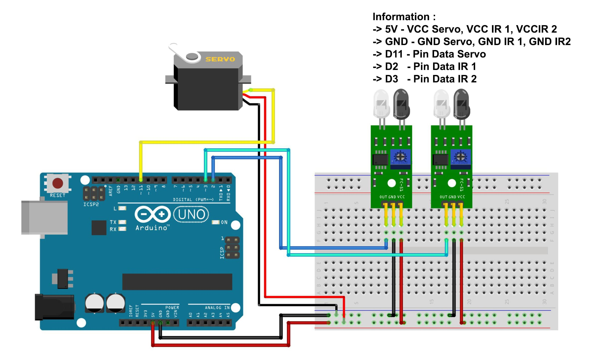

# Automatic Door Barrier with Arduino

This project demonstrates how to build an automatic door barrier using an Arduino and a servo motor. The barrier opens when an object is detected at the entrance and closes when the object leaves.

## Components

- Arduino IDE or VS Code Studio;
- Arduino UNO;
- Library: Servo;
- Servo Motor = 1 piece;
- Project Board / Breadboard = 1 piece;
- IR Sensor = 2 piece; --> Two Digital Sensors (for entrance and exit);
- Jumper Wires (Enough).

## Schematic:

- Below you can see a schematic image to facilitate the wiring of cables from the microcontroller to devices, both input and output sensors:



## Wiring Information:

- **Servo Motor:**

  - **Signal Pin** to Arduino Pin D11
  - **Power Pin** to Arduino 5V
  - **Ground Pin** to Arduino GND

- **Entrance Sensor:** --> Sensor IR 1

  - **Signal Pin** to Arduino Pin D2
  - **Power Pin** to Arduino 5V
  - **Ground Pin** to Arduino GND

- **Exit Sensor:** --> Sensor IR 2
  - **Signal Pin** to Arduino Pin D3
  - **Power Pin** to Arduino 5V
  - **Ground Pin** to Arduino GND

## Work steps

- Prepare the tools and materials to be used.
- Carry out the wiring process using Figure schematic of the above circuit.
- Open the Arduino IDE software that has been installed on laptop/computer.
- Download all the libraries above and insert the library by opening the Arduino IDE, selecting Sketch > Include Library -> Add.Zip Library.
- Type the sketch program on the Arduino IDE page.
- Carry out the program uploading process

## Code Explanation

- **Servo Control:** The servo motor is used to open (90 degrees) and close (0 degrees) the door barrier.
- **Sensors:** Two sensors detect the presence of an object. One sensor (connected to pin 2) is used for the entrance, and the other (connected to pin 3) is used for the exit.

<hr/>

## Code

```cpp
#include <Servo.h>
Servo myservo;

#define in 2
#define out 3

void setup() {
  myservo.attach(11);
  pinMode(in, INPUT);
  pinMode(out, INPUT);
}

void loop() {
  int nilai_in = digitalRead(in);
  int nilai_out = digitalRead(out);

  if(nilai_in == LOW){
    myservo.write(90);
  }
  else if (nilai_out == LOW){
    myservo.write(0);
  }
}
```

<hr/>

## Conclusion :

- The program works when an object passes through the sensor infared. Sensor 1 is placed at the entrance and sensor 2 at the exit. When an object passes through sensor, the servo will move to raise the door latch.

<hr/>
